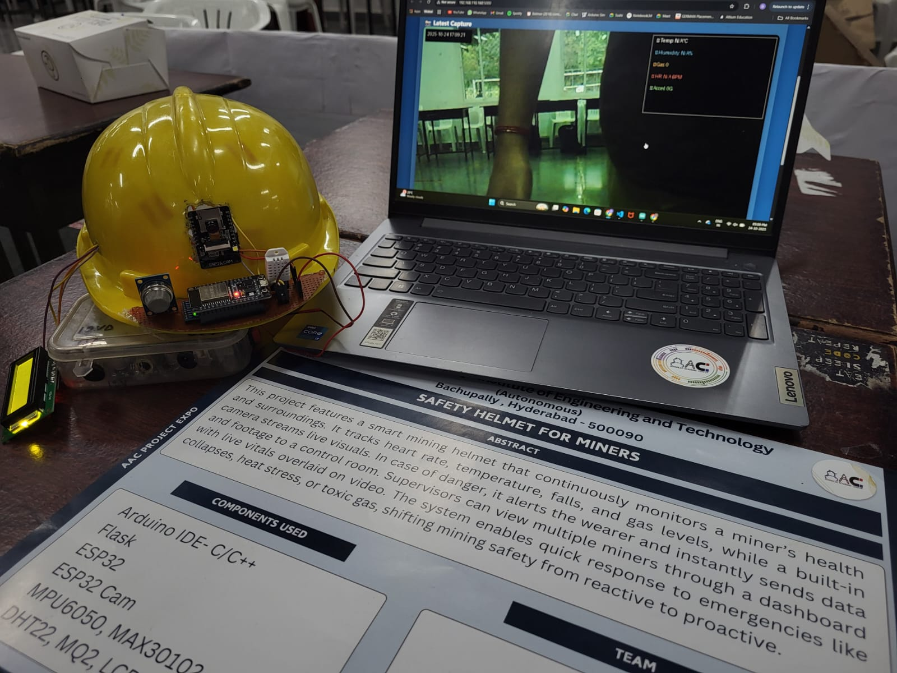
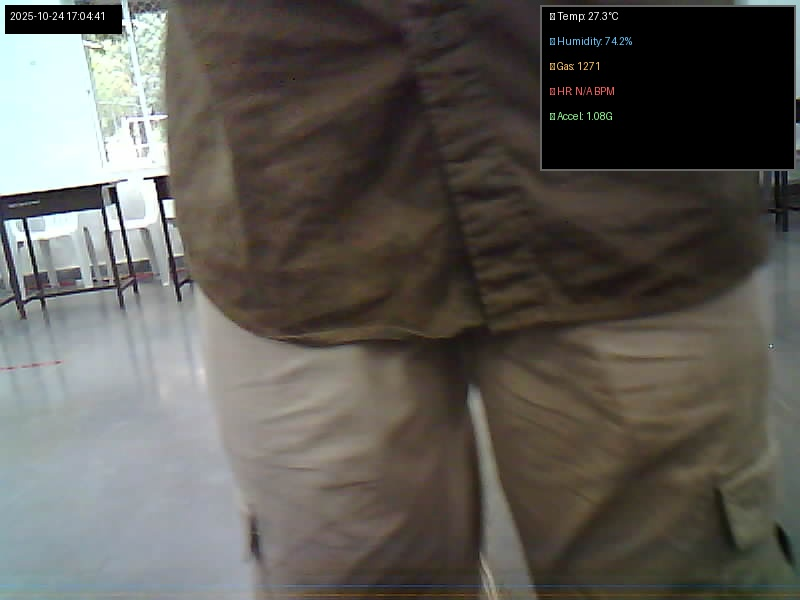

# Miner Safety Helmet System
<h2>Team Details</h2>
<b>Team Number: </b><p>25AACR23</p>
<b>Senior Mentor:</b><p>Abhiram B</p>
<b>Junior Mentor:</b><p>Annapu Dhanush</p>
<b>Team Member 1:</b><p>Dharvik</p>


<div align="center">
<h2> Abstract </h2>
</div>

The Miner Safety Helmet System addresses the critical challenge of ensuring miner safety in hazardous underground environments. This IoT-based solution continuously monitors environmental and physiological parameters in real-time to detect dangerous conditions. The system integrates multiple sensors including MQ2 for toxic gas detection, DHT22 for temperature and humidity monitoring, and MPU6050 for fall detection. An ESP32-CAM captures images every 10 seconds with overlayed sensor data and timestamps. All data is transmitted to a local Flask server that provides real-time visualization and instant alerts when hazardous conditions are detected. The system operates completely locally without requiring internet connectivity, making it ideal for underground mining operations where network access is limited.

## Table of Contents
- [Introduction](#introduction)
- [Requirements](#requirements)
- [How to use](#installation-and-usage)
- [Preview](#previews)
- [Improvements](#improvements)
- [Contribution](#contribution)

## Introduction

Mining operations expose workers to numerous hazards including toxic gases, extreme temperatures, falls, and cardiac emergencies. This smart helmet system provides comprehensive monitoring and early warning capabilities to protect miners in real-time. By combining environmental sensors, physiological monitoring, and visual documentation, the system creates a complete safety net that can detect and alert supervisors to dangerous conditions before they become life-threatening.

**Key Features:**
- **MQ2 Gas Sensor:** Detects toxic gases and smoke with configurable threshold alerts
- **DHT22 Sensor:** Monitors temperature and humidity for heat stress detection
- **GY-521 (MPU6050):** Detects falls and sudden impacts through accelerometer data
- **MAX30102:** Measures heart rate for physiological monitoring
- **ESP32-CAM:** Captures images every 10 seconds with sensor data overlay
- **Flask Server:** Local web server for real-time monitoring and visualization
- **Multi-Alert System:** Buzzer alerts on helmet + instant server notifications
- **Fully Local:** No internet required - operates on local WiFi network

## Requirements

### Hardware
- **ESP32 WROOM** (Main controller for sensors)
- **ESP32-CAM WROVER** (Camera module)
- **MQ2 Gas Sensor** (Toxic gas detection)
- **DHT22 Temperature & Humidity Sensor**
- **MPU6050 (GY-521)** 6-axis accelerometer/gyroscope
- **MAX30102** Heart rate and pulse oximeter sensor
- **16x2 LCD Display with I2C module**
- **Active Buzzer** (Alert system)
- **Push Button** (Manual capture trigger)
- **Connecting wires and breadboards**
- **Power Supply** (batteries/power bank for portable operation)
- **WiFi Router** (for local network communication)

### Software
- **Arduino IDE** (version 1.8.x or higher)
- **ESP32 Board Package** (install via Board Manager)
- **Python 3.7+** (for Flask server)
- **Flask** (`pip install flask`)
- **Pillow (PIL)** (`pip install pillow`)

### Arduino Libraries
- WiFi (ESP32 built-in)
- Wire (I2C communication)
- LiquidCrystal_I2C
- Adafruit_MPU6050
- Adafruit_Sensor
- DHT sensor library
- MAX30105 (SparkFun)
- esp_camera (ESP32-CAM)
- HTTPClient

## Installation and Usage

### Step 1: Clone the Repository
```bash
git clone https://github.com/AAC-Open-Source-Pool/25AACR23.git
cd 25AACR23
```

### Step 2: Hardware Setup
1. Wire the components according to the circuit diagram below:
   - **ESP32 WROOM Connections:**
     - LCD: SDA→GPIO21, SCL→GPIO22
     - MPU6050: SDA→GPIO25, SCL→GPIO26
     - MAX30102: SDA→GPIO32, SCL→GPIO33
     - DHT22: Data→GPIO4
     - MQ2: Analog Out→GPIO34
     - Buzzer: GPIO27
     - Button: GPIO0 (Boot button)
     - UART to ESP32-CAM: TX2→GPIO17, RX2→GPIO16

   - **ESP32-CAM WROVER Connections:**
     - Camera pins: (pre-configured in AI-Thinker module)
     - LED: GPIO33
     - UART to WROOM: RX→GPIO16, TX→GPIO17

2. Ensure both ESP32 boards share a common ground
3. Power both boards appropriately (5V recommended)

### Step 3: Configure WiFi and Server
1. Open `esp32_code.ino` in Arduino IDE
2. Update WiFi credentials in `esp32_cam_code.ino`:
   ```cpp
   const char* ssid = "YOUR_WIFI_SSID";
   const char* password = "YOUR_WIFI_PASSWORD";
   ```

3. Find your computer's local IP address:
   - **Windows:** Run `ipconfig` in Command Prompt
   - **Linux/Mac:** Run `ifconfig` or `ip addr` in Terminal

4. Update the server URL in `esp32_cam_code.ino`:
   ```cpp
   const char* serverUrl = "http://YOUR_LOCAL_IP:5000/upload";
   ```

5. Update the same IP in `SHM_Server.py` at the bottom:
   ```python
   print('Server: http://YOUR_LOCAL_IP:5000')
   ```

### Step 4: Upload Code to ESP32 Boards
1. **For ESP32 WROOM:**
   - Select Board: "ESP32 Dev Module"
   - Select correct COM Port
   - Upload `esp32_code.ino`

2. **For ESP32-CAM WROVER:**
   - Select Board: "AI Thinker ESP32-CAM"
   - Connect GPIO0 to GND for programming mode
   - Upload `esp32_cam_code.ino`
   - Disconnect GPIO0 from GND and press reset

### Step 5: Install Python Dependencies
```bash
pip install flask pillow
```

### Step 6: Start the Flask Server
```bash
python SHM_Server.py
```

The server will start at `http://YOUR_LOCAL_IP:5000`

### Step 7: Access the Monitoring Dashboard
Open a web browser and navigate to:
```
http://YOUR_LOCAL_IP:5000
```

You should see the real-time monitoring dashboard with auto-refreshing images and sensor data.

### Step 8: System Operation
- The helmet will automatically capture images every 10 seconds
- Sensor data is continuously monitored and displayed on the LCD
- Alerts trigger when thresholds are exceeded:
  - **Fall Detection:** Acceleration > 2.5G
  - **Temperature:** < 10°C or > 35°C
  - **Gas Level:** > 2000 (analog reading)
  - **Heart Rate:** < 50 or > 120 BPM
- Manual capture can be triggered by pressing the button on GPIO0
- All images are saved with sensor data overlay in the `uploads_overlay/` folder

## Preview
<div align="center">
  
  <p><i>Miner Safety Helmet with integrated sensors and ESP32-CAM</i></p>
</div>

<div align="center">
  
  <p><i>Real-time monitoring dashboard showing live camera feed with sensor overlay</i></p>
</div>

## System Architecture

```
┌─────────────────────────────────────────────────┐
│           MINER SAFETY HELMET                   │
│  ┌──────────────────┐  ┌────────────────────┐  │
│  │   ESP32 WROOM    │  │   ESP32-CAM        │  │
│  │                  │←→│    WROVER          │  │
│  │  - MQ2 Sensor    │  │                    │  │
│  │  - DHT22         │  │  - Camera Module   │  │
│  │  - MPU6050       │  │  - WiFi TX         │  │
│  │  - MAX30102      │  │                    │  │
│  │  - LCD Display   │  │                    │  │
│  │  - Buzzer        │  │                    │  │
│  └──────────────────┘  └────────────────────┘  │
└─────────────────────────────────────────────────┘
                    │
                    │ WiFi (Local Network)
                    ↓
        ┌───────────────────────┐
        │   Flask Server        │
        │   (Python)            │
        │                       │
        │  - Image Processing   │
        │  - Data Overlay       │
        │  - Alert Management   │
        │  - Web Dashboard      │
        └───────────────────────┘
                    │
                    ↓
        ┌───────────────────────┐
        │   Web Browser         │
        │   (Monitoring UI)     │
        │                       │
        │  - Live Camera Feed   │
        │  - Sensor Data        │
        │  - Alert History      │
        └───────────────────────┘
```

## Alert Thresholds

| Parameter | Low Threshold | High Threshold | Alert Action |
|-----------|---------------|----------------|--------------|
| Temperature | 10°C | 35°C | 3 buzzer beeps + server alert |
| Gas Level | - | 2000 | 4 buzzer beeps + server alert |
| Heart Rate | 50 BPM | 120 BPM | 2 buzzer beeps + server alert |
| Acceleration | - | 2.5G | 5 buzzer beeps + server alert |

## Troubleshooting

**LCD Not Displaying:**
- Check I2C address (try 0x27 or 0x3F)
- Verify SDA→GPIO21 and SCL→GPIO22 connections
- Ensure 5V power supply

**Camera Not Connecting:**
- Verify UART connections (TX↔RX crossed)
- Check WiFi credentials in code
- Ensure server IP is correct and reachable

**Sensors Not Reading:**
- Check power supply voltage (3.3V for MAX30102, 5V for others)
- Verify I2C bus separation (different GPIO pairs)
- Test each sensor individually

**Server Not Receiving Images:**
- Confirm Flask server is running
- Check firewall settings
- Verify both devices are on same WiFi network
- Test with `curl http://YOUR_IP:5000` from command line

## Improvements
- **GPS Integration:** Add location tracking for miners working in large mine complexes
- **LoRa Communication:** Implement LoRa modules for extended range communication in deep mines where WiFi is unavailable
- **Battery Management:** Add battery monitoring with low-power sleep modes to extend operation time
- **Machine Learning:** Implement anomaly detection algorithms to predict dangerous conditions before they occur
- **Multi-Helmet Network:** Create mesh network for communication between multiple helmets
- **Cloud Backup:** Optional cloud integration for data backup when internet is available
- **Voice Alerts:** Add speaker for audio warnings and two-way communication
- **Dust Sensor:** Include particulate matter sensor for air quality monitoring

## Contribution 
**This section provides instructions and details on how to submit a contribution via a pull request. It is important to follow these guidelines to make sure your pull request is accepted.**

1. Before choosing to propose changes to this project, it is advisable to go through the readme.md file of the project to get the philosophy and the motive that went behind this project. The pull request should align with the philosophy and the motive of the original poster of this project.

2. To add your changes, make sure that the programming language in which you are proposing the changes should be the same as the programming language that has been used in the project. The versions of the programming language and the libraries(if any) used should also match with the original code.

3. Write documentation on the changes that you are proposing. The documentation should include the problems you have noticed in the code(if any), the changes you would like to propose, the reason for these changes, and sample test cases. Remember that the topics in the documentation are strictly not limited to the topics aforementioned, but are just an inclusion.

